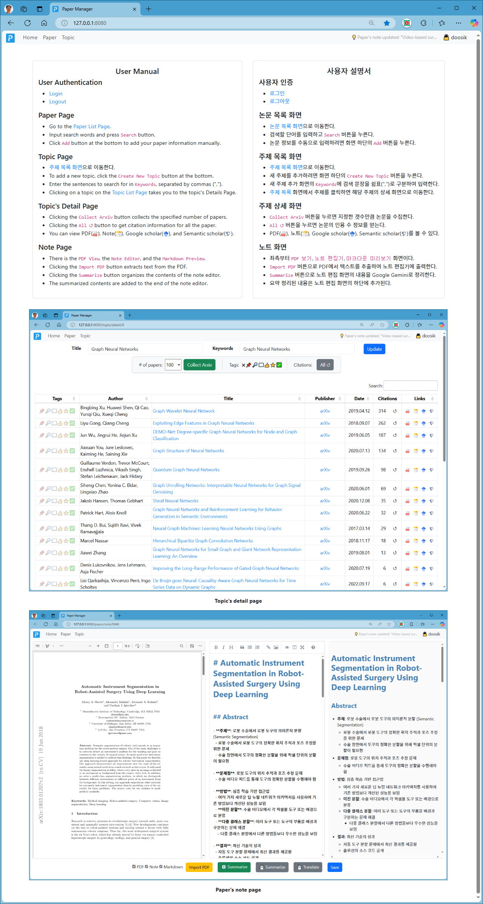

# 논문 관리 도구 (Paper Manager)

## 사용 방법

### 코드 다운로드

```bash
git clone git@github.com:doosik71/paperman2.git
```

### 파이썬 설치

- <https://www.python.org/>에서 파이썬을 설치한다.

### 패키지 설치

- 아래의 명령으로 필요한 패키지를 설치한다.

```bash
pip install -r requirements.txt
```

### 데이터베이스 파일 생성

```bash
python manage.py makemigrations
python manage.py migrate
```

### 관리자 계정 생성

- 아래의 명령으로 관리자 계정을 생성한다.

```bash
python manage.py createsuperuser
```

### 서버 실행

- 아래의 명령으로 서버를 실행한다.

```bash
python manage.py runserver 8090
```

- 원격 접속을 허용하려면 아래의 명령을 실행한다.

```bash
python manage.py runserver 0.0.0.0:8090
```

### 서버 접속

- 웹 브라우저에서 <http://localhost:8090/>에 접속한다.

### 로그인

- 웹 브라우저에서 <http://localhost:8090/login>에 접속한다.

### 실행 환경 설정

- 웹 브라우저에서 <http://localhost:8090/config>에 접속한다.

#### 논문 자동 요약을 위한 URL 및 API 설정

- **Google Gemini의 API 키**:
  - 환경 설정 화면에서 Google Gemini의 API 키를 입력한다.
  - Google Gemini의 API 키는 <https://aistudio.google.com/apikey>에서 무료로 얻을 수 있다.
  - API 키 생성 후 API 제한사항에 "Generative Language API" 기능이 허용되어 있는지 확인한다.
- **OpenRouter의 API 키**:
  - 환경 설정 화면에서 OpenRouter의 API 키를 입력한다.
  - OpenRouter의 API 키는 <https://openrouter.ai/settings/keys>에서 무료로 얻을 수 있다.
- **Ollama의 URL**:
  - 환경 설정 화면에서 Ollama의 URL을 입력한다.
  - Ollama의 URL은 "http://{ip-address}:11434/api/generate"의 형식이다.
- **논문 요약을 위한 프롬프트**:
  - 환경 설정 화면에서 논문 요약을 위한 프롬프트를 입력한다.
  - 프롬프트 예시는 [prompt.md](./prompt.md) 문서를 참조한다.
- **발표자료 작성을 위한 프롬프트**:
  - 환경 설정 화면에서 발표자료 작성을 위한 프롬프트를 입력한다.
- **Adobe PDF Viewer의 API 키**:
  - 환경 설정 화면에서 Adobe PDF Viewer의 API 키를 입력한다.
  - Adobe PDF Viewer의 API 키는 <https://acrobatservices.adobe.com/dc-integration-creation-app-cdn/main.html?api=pdf-embed-api#>에서 무료로 얻을 수 있다.

### 자세한 사용 방법

- 자세한 사용 방법은 홈 화면을 참조한다.



#### 논문 요약 모델 비교

| Model                                                  | Parameters | Context | Output Token | Cost(In / Out)($) |
|--------------------------------------------------------|-----------:|--------:|-------------:|:-----------------:|
| Google GenAI Gemini 2.0 Flash                          |     262.0B |      1M |           8K |     0.1 / 0.4     |
| Google GenAI Gemini 2.0 Flash-Lite                     |      20.3B |      1M |           8K |   0.075 / 0.300   |
| OpenRouter Google Gemini 2.0 Flash Experimental (free) |      29.7B |      1M |           8K |       0 / 0       |
| OpenRouter Google Gemini 2.0 Flash-Lite                |      20.3B |      1M |           8K |   0.075 / 0.300   |
| OpenRouter Google Gemini 1.5 Flash                     |       8.0B |      1M |           8K |  0.0375 / 0.1500  |
| OpenRouter DeepSeek R1 (free)                          |      73.3B |    164K |         164K |       0 / 0       |
| OpenRouter DeepSeek R1 Zero (free)                     |       1.4B |    164K |         164K |       0 / 0       |
| OpenRouter DeepSeek V3 0324 (free)                     |      84.3B |    131K |         131K |       0 / 0       |
| OpenRouter DeepSeek V3 (free)                          |      16.8B |    131K |         131K |       0 / 0       |
